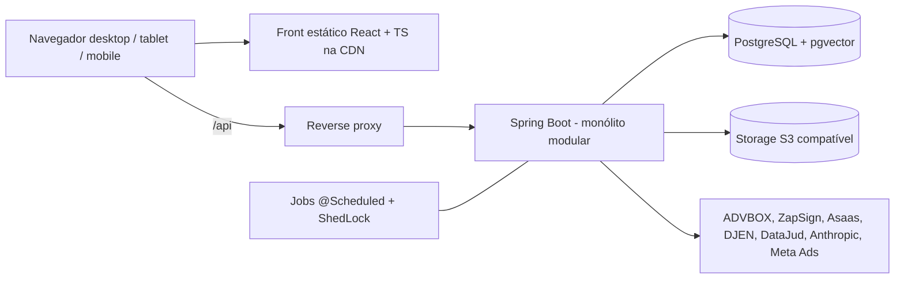

# Plano de arquitetura — Backend Java 17 + Spring para o sistema Oliveira Advogados

Base: `DOCUMENTACAO.md` (SPA React + Supabase). Escopo: manter o front, substituir o Supabase por backend próprio em Java 17/Spring com PostgreSQL.

## 1. Diagnóstico

| Item | Hoje | Impacto na migração |
| --- | --- | --- |
| Front | React 18 + TS + Vite, \~150 telas, 247 componentes, 37 hooks | **Já é TypeScript.** UI se mantém; a **camada de dados não** |
| Acesso a dados | `supabase.from()/rpc()/functions.invoke()` direto do navegador | Principal custo: cada tela/hook que chama o Supabase precisa de um endpoint REST |
| Autorização | **\~679 políticas RLS** + helpers SQL (`has_role`, `is_ceo`, `user_org_ids`…) | Regras migram para o Spring; é o maior risco de vazamento de dados |
| Auth | Supabase Auth (e-mail/senha, Google, convite, reset) | Substituir por Spring Security |
| Backend | 56 Edge Functions Deno | Viram services/clients Java |
| Banco | \~184 tabelas, 2 sistemas de migração (Supabase 200 + Drizzle 56) | Consolidar em Flyway |
| Jobs | `pg_cron` + `pg_net` | `@Scheduled` + ShedLock |
| Tempo real | Feed, Inbox, Mensagens | SSE/WebSocket |
| Arquivos | 9 buckets Supabase Storage | S3 compatível + URLs assinadas |
| IA | Claude + fallback Lovable Gateway + embeddings | Cliente Java; trocar o provedor de embeddings |

## 2. Arquitetura alvo

**Monólito modular** (Spring Modulith), não microserviços: um escritório, um banco, \~184 tabelas. Módulos com fronteira verificada por teste (ArchUnit/Modulith).

Mesmo domínio para front e API (`/api` via proxy): evita CORS e permite cookie `httpOnly` para o refresh token. **Hospedar o backend no Brasil**: o DJEN bloqueia IPs de fora; isso elimina o "pin" em sa-east-1.

## 3. Stack sugerida

- Java 17, Spring Boot (linha estável mais recente que rode em Java 17 — confirmar em start.spring.io), Spring Web, Validation, Security, Data JPA.
- **jOOQ ou JdbcTemplate** para consultas pesadas (dashboards, `mkt_dashboard_agregado`, `saude_sistema`); JPA para CRUD.
- **Flyway** (baseline = `pg_dump --schema-only` do banco atual) e fim do Drizzle.
- **springdoc-openapi** → gera o contrato; no front, **Orval** ou openapi-typescript gera client tipado e hooks de React Query (já usado no projeto).
- Resilience4j (backoff 429 do ADVBOX/ZapSign), ShedLock (jobs sem duplicar em 2+ instâncias), Micrometer/Actuator, Testcontainers.
- PDF: OpenPDF ou openhtmltopdf. DOCX: Apache POI/docx4j. TOTP: `javax.crypto` (AES-GCM).

## 4. Mapeamento Supabase → Java

| Hoje | Depois |
| --- | --- |
| `supabase.from()` + RLS | Controllers REST + services + `@PreAuthorize`/Specifications por organização |
| Supabase Auth | Spring Security + JWT (access curto + refresh em cookie); Google via OAuth2 client |
| `_shared/auth.ts`, `controladoria.ts` | Filtros/handlers: JWT interno, `x-cron-secret`, `x-api-key`, rejeição de usuário do portal |
| `ia-claude.ts` (fallback + `ia_consumo`) | `IaGateway` com fallback e registro de consumo |
| `olivia-portal` (streaming) | SSE (`SseEmitter`) |
| `zapsign-webhook` | Endpoint público com `x-zapsign-secret` + idempotência |
| `djen-captura`, `datajud-*`, `controladoria-d5`, `advbox-sync` | Jobs `@Scheduled` + clients dedicados |
| `api-gateway`, `api-keys` | Filtro de API key |
| `totp-tribunais` | Service com a mesma cifra AES-GCM (**conferir layout de IV/tag para ler os segredos já gravados**) |
| `app_secrets`, Secrets das functions | Variáveis de ambiente / secret manager |
| Buckets + políticas por caminho | S3 + URL assinada gerada após checar permissão |
| `lerTudo()` (blocos de 1000) | Paginação no servidor |
| Modo "Ver como" (guarda no cliente) | Header `X-View-As` aceito **só em GET**, escrita rejeitada no servidor, auditoria |
| Feed/Inbox/Mensagens realtime | SSE para notificações; WebSocket (STOMP) para mensagens |

## 5. Decisões-chave (registrar como ADR)

1. **Autorização.** Recomendo regras explícitas no Spring (matriz papel × módulo vinda de `usePermissions`/`MODULE_CATALOG` + escopo por `organizacao_id` + vínculo do portal). Opcional: manter RLS como segunda camada via `SET LOCAL` por transação. Hoje o front só faz UX; no novo modelo a barreira real passa a ser a API.
2. **Autenticação.** Preservar os `uuid` de `auth.users` (FKs). Os hashes do Supabase são bcrypt: `BCryptPasswordEncoder` os valida sem pedir reset de senha. Alternativa mais pronta: Keycloak.
3. **RPCs e triggers.** Fase 1: manter no banco e chamar via JDBC (`trein_quiz_responder`, `fundir_clientes`, auditoria, `trg_*`). Portar para Java só o que for regra de negócio volátil.
4. **Embeddings/RAG.** `match_olivia_conhecimento` fica com pgvector. O gateway da Lovable some, então escolher outro provedor de embeddings e **reindexar** (dimensão muda).
5. **Storage.** S3/MinIO/R2 com migração dos objetos; manter o mesmo padrão de caminho.

## 6. Módulos Java (pacotes por domínio)

`identity` (membros, grupos, ver-como) · `cliente` · `processo` · `laudo` · `peticao` · `operacao` (crédito, vencimentos, fila) · `notificacaobanco` · `controladoria` (**isolado**, calendário próprio, nunca usa `processos`) · `treinamento` (+ provas) · `assinatura` · `comercial` · `marketing` · `consultoria` · `posvenda` · `rh` · `financeiro` · `portal` · `mensagens` · `ia` · `integracao` (advbox, zapsign, asaas, meta, djen, datajud, clima/agro) · `arquivo` · `plataforma` (feriados, auditoria, saúde, api-keys).

Respeitar as invariantes da seção 9 da documentação (Controladoria isolada, setor via `membro_setores`, gabarito nunca no cliente, assinaturas por `enviado_por` + admins).

## 7. Estratégia de migração (strangler, sem big-bang)

| Fase | Entrega | Esforço |
| --- | --- | --- |
| 0. Descoberta | Inventário de todo `from()/rpc()/invoke()` (grep) → matriz tela × tabela × endpoint; ADRs; `pg_dump`; ambientes | P |
| 1. Fundação | Repositório, CI/CD, Flyway baseline, OpenAPI, observabilidade; **Spring valida o JWT do Supabase** (JWKS/segredo) para o front continuar logando enquanto os módulos migram | M |
| 2. Camada de dados no front | `lib/api` + hooks de React Query chamando o Spring; trocar tela a tela atrás de feature flag | M (contínuo) |
| 3. Módulos simples | Feriados, templates, calculadoras, causas avulsas, ofertas | P |
| 4. Núcleo | Clientes, processos, operações, tarefas, vencimentos, notificações bancárias | G |
| 5. IA e documentos | Laudos, petições, análise de contrato, OlivIA, PDF/DOCX | G |
| 6. Integrações e jobs | ADVBOX, DJEN, DataJud, Controladoria, ZapSign, Asaas, Meta | G |
| 7. Treinamentos, RH, financeiro | Dados sensíveis (salário, CEO): testes de autorização reforçados | M |
| 8. Portal externo | Cliente/empresa com escopo por vínculo (substitui views + RLS) | M |
| 9. Corte | Auth próprio, storage, realtime; desligar Supabase e Edge Functions | M |

Em cada módulo: **testes de autorização por perfil** (admin, coordenador, membro, CEO, portal_cliente, portal_empresa) usando Testcontainers. Reaproveitar os testes de RLS de `src/test` como especificação.

## 8. Front: está pesado? Reescrever?

**Não está pesado e não precisa ser reescrito.** Já é TypeScript, e o pacote inicial de \~171 KB gzip com rotas lazy é um bom número para mobile.

| Opção | Veredito |
| --- | --- |
| Manter React + TS + Vite | **Recomendado.** Custo zero de reescrita, ecossistema do time, Tailwind já responsivo |
| Svelte/Solid/Vue/Angular | Ganho de runtime imperceptível frente a reescrever \~400 arquivos |
| Flutter Web / Blazor WASM | Pior: runtime de vários MB, UX web inferior |
| Vaadin/Thymeleaf (server-side Java) | Descarta o front existente e acopla UI ao servidor |

O que realmente pesa (conferir com `rollup-plugin-visualizer`): `xlsx`, `jspdf`, `react-pdf`, `recharts`, `framer-motion`. Garantir `import()` dinâmico só nas telas que usam e mover geração de PDF para o backend.

Melhorias para tablet/mobile:

- PWA (`vite-plugin-pwa`) para o **Modo Campo** (cache e instalação); Capacitor se um dia precisar de loja de apps.
- Auditar telas densas (Kanban, tabelas grandes): layout de cartões em \< 768 px, alvos de toque ≥ 44 px.
- Virtualizar listas (TanStack Virtual) e paginar no servidor.
- Medir com Lighthouse em Android de entrada e conexão 3G/4G.

*Ressalva:* baseei-me na documentação, não no código. O tamanho real dos chunks precisa ser medido.

## 9. Riscos

- **Vazamento por regra de acesso esquecida** (RLS → Java). Mitigação: matriz de permissões + testes por perfil antes de cada corte.
- **Lovable continua editando o front.** O editor assume Supabase; exportar para o GitHub e tirar o front do fluxo Lovable, ou isolar a camada de dados.
- **Segredos** (ADVBOX, ZapSign, Asaas, Anthropic, TOTP): rotacionar no corte; `TOTP_ENCRYPTION_KEY` precisa ser preservada.
- **Dados duplicados em dois sistemas** durante a transição: evitar dual-write; cada módulo tem um único dono.
- **Jobs duplicados** (DJEN 6×/dia, D-5, ADVBOX 06:00): desligar o `pg_cron` do módulo no momento do corte, com ShedLock no novo.

## 10. Perguntas em aberto

1. O Postgres continua no Supabase na transição ou vai direto para outro host (RDS, Cloud SQL etc.)?
2. Auth próprio ou Keycloak?
3. Onde hospedar (nuvem/região) e quem opera?
4. Alguma tela pode ser descontinuada? (74 telas + abas; cortar escopo reduz muito o esforço)
5. Há prazo ou janela de corte?